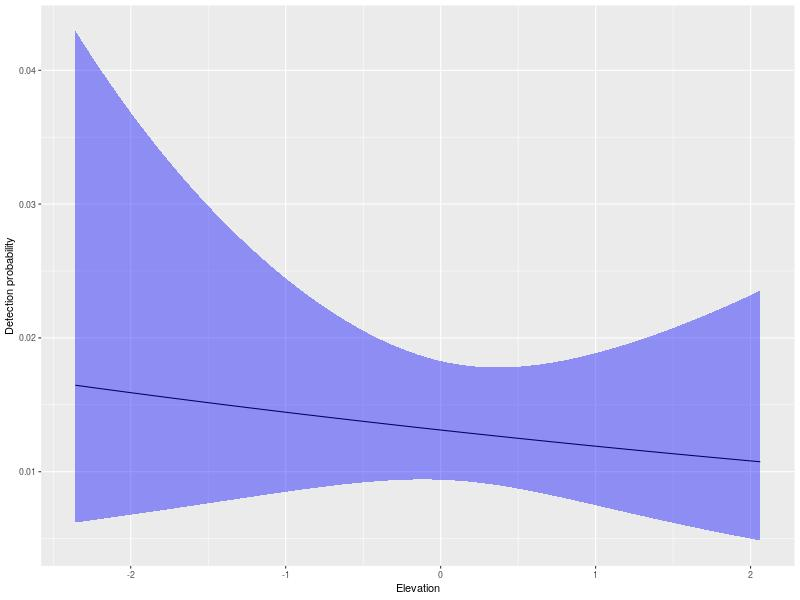

# Xenarthra
Analise de dados de Xenartros da REBIO do Gurupi.
Por Elildo Carvalho Jr, Alexandre Martins e Eloisa Mendonca
Para artigo em preparação sobre tamanduas e tatus na REBIO


### Description
```src``` This directory has the code for running the analysis.

```data``` Raw and processed data. 

```bin``` A bundle of useful codes needed to fix the raw data or functions that are called by the main analysis codes in ```src``` directory.

```results``` This directory contains results from the analysis such as tables, figures etc. 




# Contact Us
If you have any questions please contact <elildojr@gmail.com>
