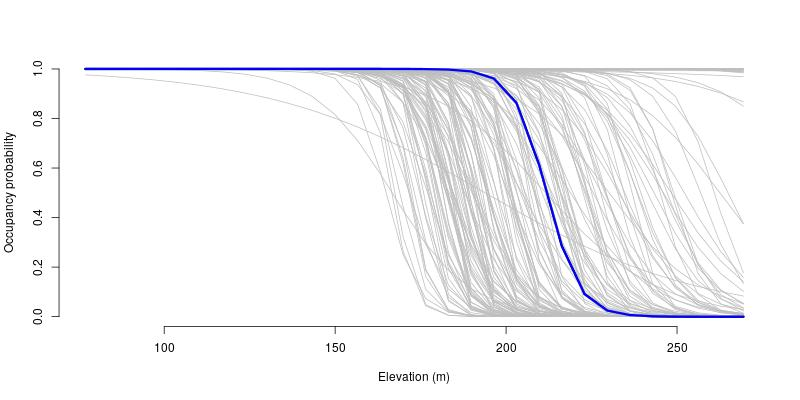

# Xenarthra
Analise de dados de Xenartros da REBIO do Gurupi.
Por Elildo Carvalho Jr, Alexandre Martins e Eloisa Mendonca
Para artigo em preparação sobre tamanduas e tatus na REBIO


### Descrição
```src``` Este diretório contém os códigos para as análises.

```data``` Dados brutos e processados. 

```bin``` Um conjunto de códigos úteis para consertar os dados brutos ou funções que são chamadas pelos códigos da análise que estão no diretório ```src```.

```results``` Este diretório contém os resultados das análises, como tabelas, figuras, etc. 




# Contato
Se tiver questões entre em contato com <elildojr@gmail.com>
